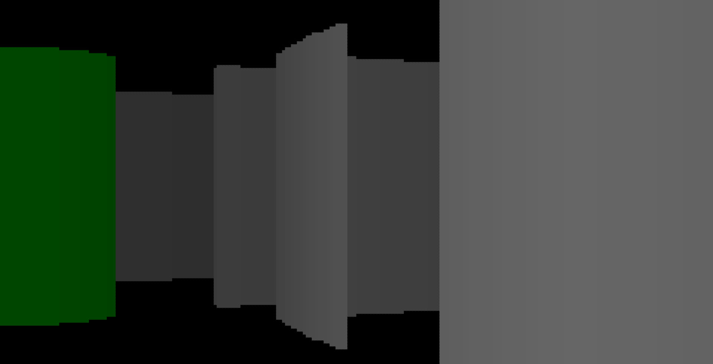
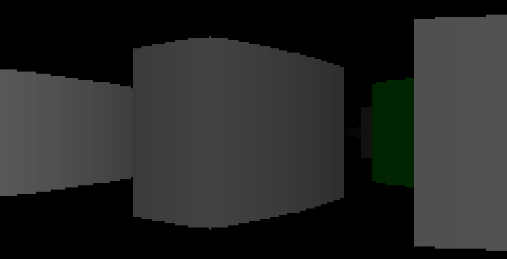

[](https://gitlab.com/morgaux/wolfenstein/-/commits/rewrite_in_c)
[](https://gitlab.com/morgaux/wolfenstein/-/commits/rewrite_in_c)
[](https://gitlab.com/morgaux/wolfenstein/-/commits/rewrite_in_c)
[](https://gitlab.com/morgaux/wolfenstein/-/commits/rewrite_in_c)
[](https://gitlab.com/morgaux/wolfenstein/-/commits/rewrite_in_c)
[](https://gitlab.com/morgaux/wolfenstein/-/commits/rewrite_in_c)
[](https://gitlab.com/morgaux/wolfenstein/-/commits/rewrite_in_c)

# A Wolfenstein 3D Clone

This repo contains a pet project of mine that I've been toying with for years. I
finally sat down and wrote the original version of this in JavaScript, mainly as
a proof of concept. I was able to render simple scenes from a 2D map on to an
HTML canvas element. However, due to the complex math required to calculate the
trajectories of the rays, as well as scale the resulting scene to provide the
illusion of depth, the performance of this original version was poor.
Additionally, the calculations for scaling the surfaces by distance were
slightly off, resulting in a fish-eye effect.





## Rewrite using raycastlib
Using JS for a rendering library is really not a great choice, both in terms of
performance and usability, and of course I would have preferred to use a
compiled language, however, I used JS as I preparing for a Microsoft Exam on JS
at the time and needed an excuse to actually work on this pet project that I had
been mulling over since I made Pac-Man in highschool (incidentally also in JS
as that was all I knew at the time, sadly the code for the Pac-Man game has been
lost to time).

The original JS version of the raycasting I created was mainly an experiment to
learn about raycasting, ideally with the goal of going from Wolfenstein3D to
Doom like graphics. However, my interest and personal learning is now leaning
more towards C and C++, and so I'll be using the simple rendering libraries
[raycastlib](https://gitlab.com/drummyfish/raycastlib) and
[small3dlib](https://gitlab.com/drummyfish/small3dlib) as the rendering backend,
and focus primarily on creating a simple game.

## Building and Installation

To build Wolfenstein3D locally, run:

```sh
make
```

To build and install Wolfenstein3D, run:

```sh
sudo make clean install
```

By default, the build configuration is in DEBUG mode, to build in RELEASE or
CURRENT mode, pass the `FLAVOUR` variable on the commandline or configure this
in the config.mk file:

```sh
sudo make FLAVOUR=RELEASE clean install
```

## Configuration

There are numerous configuration options for the build process alone, and many
further configurations may be made in the config.h header file. Below are some
of the options that may be provided on the commandline invocation of `make`.

### Compilation Config

The compilation of Wolfenstein3D may be configured via the following variables.

* `FLAVOUR` - Available values are `DEBUG` (default), `CURRENT`, and `RELEASE`.
  These constraints are not enforced, however, as these are defined to the C
  preprocessor, e.g. for use with `#ifdef` etc, these values are the only values
  officially supported and exactly one of these must be defined. This value is
  also used for distribution and version control.
* `TAR_FLAGS` - These flags are passed to `tar(1)` during the creation of a
  distribution tarball. Note that the portable options are rather sparse but if
  you know that the implementations on your machine supports fancier options,
  e.g. GNU tar, these may be specified.
* `GZIP_FLAGS` - Similarly to the `tar(1)` flags, `gzip(1)` is also used during
  the creation of distributable `.tar.gz` files. It similarly has vast
  non-portable configurability which may be used if the implementation is known
  to support it.
* `DEFINES` - As previously mentioned, the `FLAVOUR` value is defined to the C
  preprocessor, allowing with special behaviour with `#ifdef DEBUG` and the
  like, in addition to this, several other symbols are defined for POSIX
  compliance and portability. Any additional symbols to defined may be passed as
  name only or with values:
  ```sh
  make DEFINES=\"_MY_DEFINE=\"My string value for '_MY_DEFINE'\"\"
  ```
* `WARNINGS` - As with the `DEFINES`, the compiler warnings my be configured,
  turned on or off, more or less verbose, as well as severity. Different options
  are available for different compilers, however, any `-W` options available for
  your compiler may be used, although the `-W` prefix should be dropped, e.g.:
  ```sh
  # Pass -Wno-cpp to disable #warning directives
  make WARNINGS="no-cpp"
  ```
* `OPTIMISATION_LEVEL` - As the Wolfenstein3D code preforms a lot of graphical
  calculations, using the `-O3` optimisation is *highly* recommended, however,
  if another optimisation level is needed, e.g. `-Og` for debugging, this
  variable may be passed directly:
  ```sh
  make OPTIMISATION_LEVEL=g
  ```
* `LANGUAGE` - By default Wolfenstein3D is written in standard C99, however, if
  at any point a different language or standard is needed, e.g. C++17, the
  `LANGUAGE` variable should be set and `STANDARD` to match.
* `STANDARD` - As with `LANGUAGE` the `STANDARD` variable defines the standard
  of the language to enforce during compilation.
* `CFLAGS` - These are the combined flags to use for the compilation of
  Wolfenstein3D, `CFLAGS` are used by well known convention, so while the above
  options combined with further details in config.mk file define `CFLAGS` any
  additional options may be passed directly on the commandline for further
  customisation. Note that `DEFINES` and `WARNINGS` should still be used where
  possible for internal consistency.
* `LDFLAGS` - As with `CFLAGS`, these are a well known convention, any required
  linker flags may be passed here as needed. At time of writing no special
  internal configuration is needed nor made within config.mk.

### Installation Config

* `PREFIX` - This is the path used for the final installation location of the
  compiled Wolfenstein3D executable. By default this is `/usr/local`, then `bin`
  subdirectory is automatically appended, however, if installation is on an
  operating system where `/usr/local` is not available, an alternative location
  may be designated.
  ```sh
  make PREFIX=/usr/share
  ```
* `MANPREFIX` - This is the path for the installation of the manpage for
  Wolfenstein3D, by default it is given as `${PREFIX}/man`, so if `PREFIX` is
  changed to a directory that doesn't contain a valid manpage location, it
  should also be updated.
* `DESTDIR` - Although both `PREFIX` and `MANPREFIX` are given as absolute
  PATHs, as in starting at the `/` root directories, an optional `DESTDIR`
  directory may be passed to change this to any arbitrary relative or absolute
  location. This allows a specific build to be installed a `./tmp` directory or
  a chroot, for example.
* `COPYRIGHT` - This is primarily used in the generation of the man page, with
  includes my own copyright notice, however, if a specific version is created
  for any purpose, as the MIT license provides, you may append your own
  copyright notice.

## Unit Testing

To assist in the development cycle, I've adopted to use a TDD (Test Driven
Development) method, and to that end the makefile build system includes an
automated test system. The details of how to write these test cases, as well as
their internal structure can be seen in the tests.mk file.

To run the full suite of automated tests, run:

```sh
make test
```

Or, to see a full list of available individual tests and their descriptions,
run:

```sh
make test_help
```

